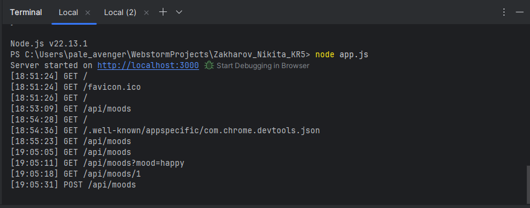
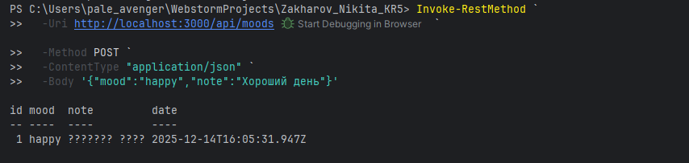
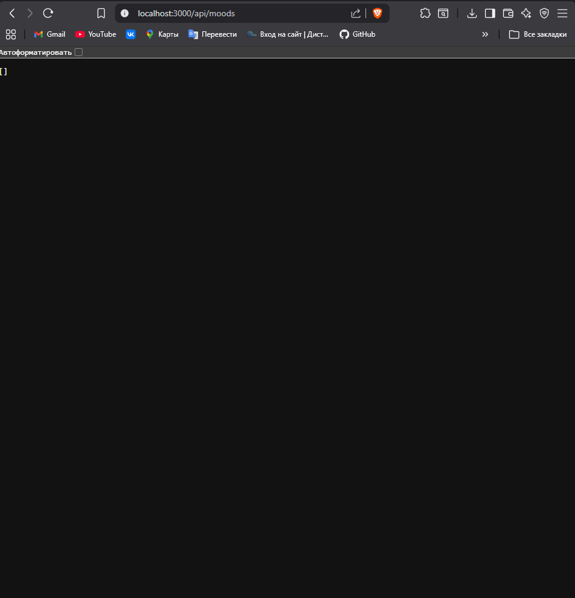
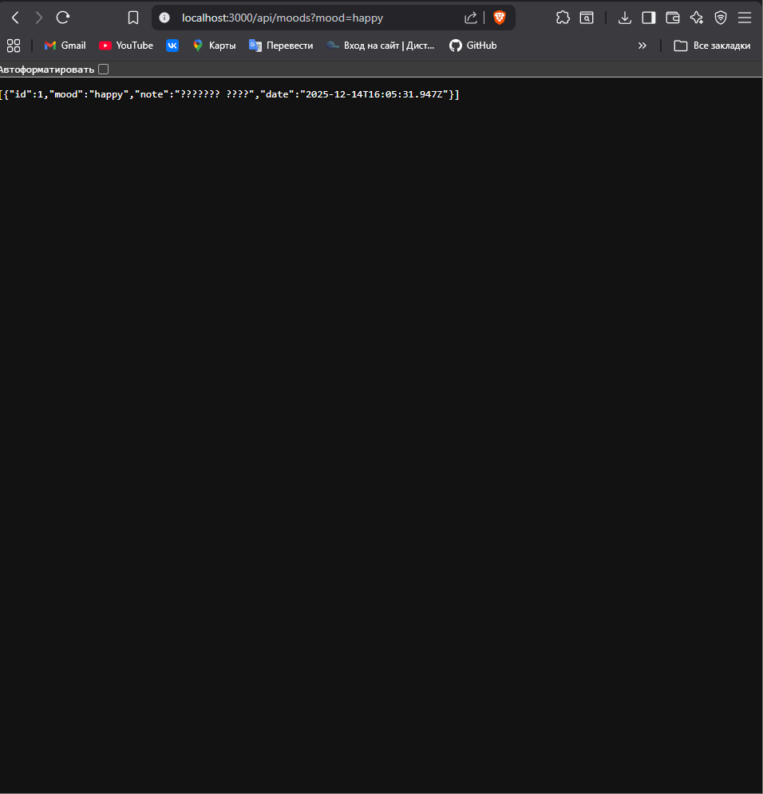

# Express-приложение Дневник настроения

## Возможности
- Базовый Express-сервер.
- Маршруты (GET, POST; PUT/DELETE)
- Работа с параметрами (req.params), query-параметрами (req.query).
- Обработка тела запроса через express.json() и/или express.urlencoded().
- middleware
- Статические файлы
- (routes + controllers)

## Запуск
npm install
node app.js

## Скриншоты

